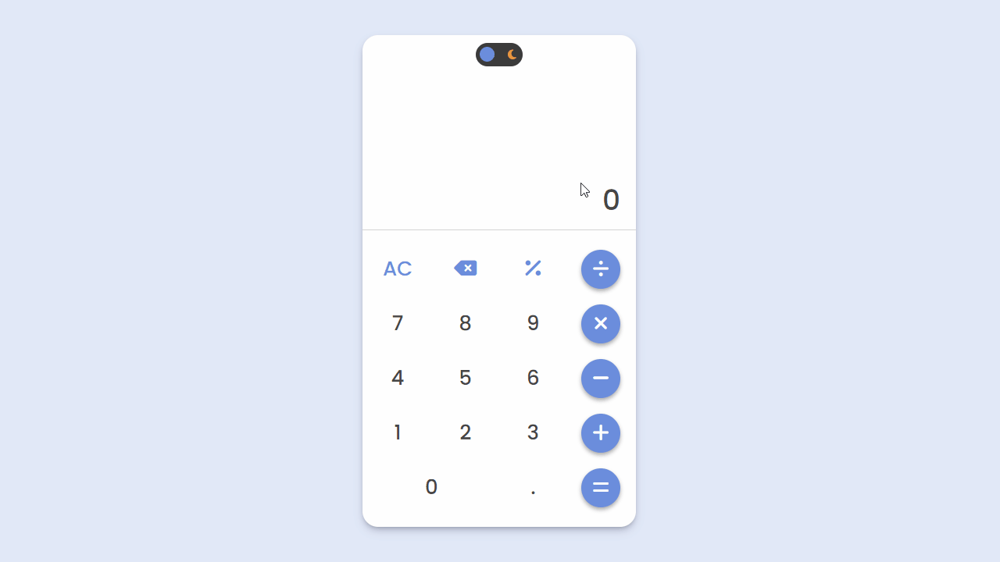

# Calculator

This project is a calculator created using HTML, CSS/SAAS, and JavaScript.

## 🔗 Link

- [Calculator](https://julianachagas.github.io/calculator/)

## 🛠️ Technologies

- HTML
- CSS
- SASS
- JavaScript

## 💡 Features

- Operations: add, subtract, multiply, and divide
- Percentage: user can get the percentage of the number entered or of any result
- Clear: the user starts fresh after pressing “clear”
- Backspace: user can undo if they click the wrong number
- Users are able to string together several operations
- An error message is displayed when the user tries to divide by 0
- Keyboard support: user can do the operations using the keyboard keys
- Toggle between light/dark mode

## 💻 Demo

  

## 👩🏻‍💻 Author

---

##### Made with 💜 by Juliana Chagas
